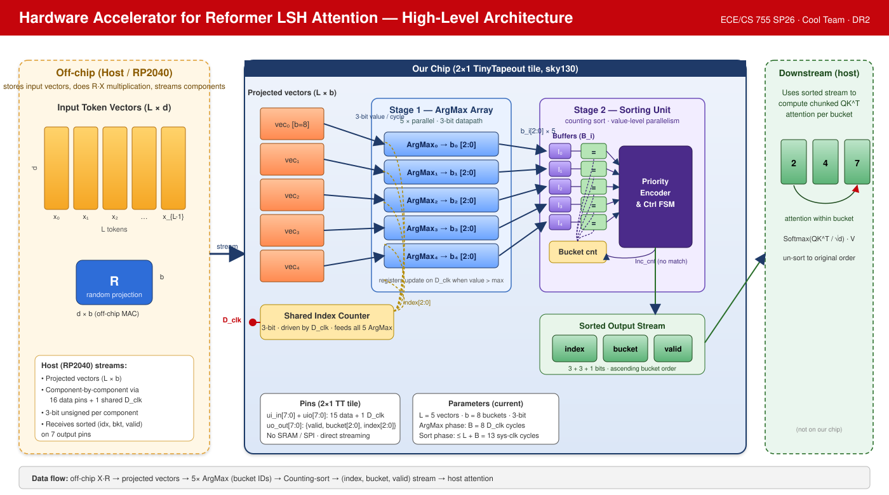

# ECE 755 SP26 — Hardware Accelerator for Reformer LSH Attention

A Tiny Tapeout (sky130, 2×1 tile) ASIC that offloads the **bucket-assignment** stage
of [Reformer](https://arxiv.org/pdf/2001.04451) LSH attention from a host
microcontroller (RP2040). The host performs the off-chip random projection
`R · X` and streams the projected components to the chip; the chip performs a
parallel **ArgMax** over each projected vector and a **counting-sort** that
groups tokens into LSH buckets. The host then completes softmax and the
value-weighted output.

- Paper: [Reformer: The Efficient Transformer](https://arxiv.org/pdf/2001.04451)
- Blog: [research.google — Reformer](https://research.google/blog/reformer-the-efficient-transformer/)
- Reference Colab: [trax/reformer/image_generation.ipynb](https://colab.research.google.com/github/google/trax/blob/master/trax/models/reformer/image_generation.ipynb)

---

## Design Overview



*Figure 1. End-to-end design overview. The host (RP2040) stores token vectors
`X (L×d)` and the random projection matrix `R`, performs the `R·X` MAC
off-chip, and streams 3-bit projected components to the ASIC over 16 data
pins gated by a shared `D_clk`. **Stage 1 — ArgMax Array** runs five
3-bit ArgMax units in parallel, each driven by a shared 3-bit index counter,
producing a bucket ID `b_i` per projected vector. **Stage 2 — Sorting Unit**
performs a counting sort over the bucket IDs using a small register file, an
equality comparator bank, and a priority-encoder/FSM, emitting the sorted
`(token_idx, bucket_id, valid)` stream back to the host on 7 output pins.*

A textual / Mermaid version of the original block diagram is also kept under
[`hardware/design/High_Level_Block_Diagram.mmd`](hardware/design/High_Level_Block_Diagram.mmd)
for editing.

---

## Architecture Summary

| Stage | Block (RTL) | Function | Datapath |
|------:|-------------|----------|----------|
| 0 | (host, off-chip) | Loads `X`, `R`; computes projected vectors `R·X`; streams components | int8 / int16 |
| 1 | `ArgMax` / `ArgMaxSync` (×5 array) | Per-vector argmax across `b=8` projected components → 3-bit bucket ID | 3-bit unsigned |
| 1c | `Control` | Drives shared 3-bit index counter and `start_sort` pulse for Stage 2 | — |
| 2 | `SortingUnit` | Counting-sort over 5 bucket IDs → `(idx, bkt, valid)` stream | 3-bit |
| 3 | (host, off-chip) | Softmax, value-weighting, un-sort to recover attention output | float / int |

Top-level RTL composition is in [`hardware/rtl/src/top.sv`](hardware/rtl/src/top.sv);
sub-blocks live under [`hardware/rtl/<Block>/`](hardware/rtl/).

**Hardware-aware quantization** (validated by the Python golden model):

- 8-bit signed `int8` embeddings and projection matrix entries
- 16-bit `int16` MAC accumulator
- Scale factor `15.0` keeps the 16-bit accumulator strictly below `±32,767` for
  `L = 128`, `d = 32` (observed peak: **11160**)

---

## Repository Layout

```
ECE755-sp26-project/
├── hardware/
│   ├── design/                       # Architecture diagrams & specs
│   │   ├── High_Level_Architecture.svg / .png   # Design overview figure (above)
│   │   ├── High_Level_Block_Diagram.mmd / .svg  # Mermaid block diagram
│   │   └── Block Diagrams/                       # Sub-block diagrams (JPGs)
│   ├── rtl/                          # SystemVerilog RTL  (DO NOT EDIT — frozen)
│   │   ├── ArgMax/                   # Asynchronous ArgMax unit + TB
│   │   ├── ArgMaxSync/               # Synchronous ArgMax unit + TB
│   │   ├── Control/                  # Shared-index FSM + TB
│   │   ├── SortingUnit/              # Counting-sort engine + TB
│   │   └── src/top.sv                # ReformerTop integration
│   ├── verification/                 # Integration & cocotb testbenches
│   │   ├── ArgMax_array_tb.sv
│   │   ├── ReformerTop_reference.sv
│   │   ├── cocotb_argmax/            # Python cocotb flow
│   │   └── Wave Pictures/            # Captured waveforms
│   └── synth/                        # Synthesis & PnR collateral
│       ├── yosys_argmax.ys
│       ├── dc_synth.tcl   genus_synth.tcl
│       ├── librelane_config.json     # LibreLane 2 (sky130) flow
│       ├── constraints.sdc           # 40 MHz clock, async reset, I/O delays
│       ├── README_EDA_GUIDE.md       # Full EDA workflow
│       └── reports/                  # Area / timing / power outputs
├── software/
│   └── emulation/                    # NumPy golden reference
│       ├── golden_model.py
│       └── sim.py
├── Review1/                          # Review 1 deliverables (proposal, slides, report)
├── Review2/                          # Review 2 deliverables (DR2 report, figures)
└── README.md                         # (this file)
```

> **Hard rule:** files under `hardware/rtl/` are frozen — inspect, analyze, and
> verify only. Add new wrappers, testbenches, scripts, configs, and reports
> outside `hardware/rtl/`.

---

## Quick Start

### 1. Run the golden model
```bash
cd software/emulation
python3 golden_model.py
```

### 2. Functional simulation (Icarus + cocotb)
```bash
# single-unit ArgMax
cd hardware/rtl/ArgMax
iverilog -g2012 -o sim_argmax ArgMax.sv ArgMax_tb.sv && vvp sim_argmax

# 5×ArgMax integration TB
cd hardware/verification
iverilog -g2012 -o sim_arr ../rtl/ArgMax/ArgMax.sv ArgMax_array_tb.sv && vvp sim_arr

# Python cocotb flow
cd hardware/verification/cocotb_argmax && make
```

### 3. Synthesis (open-source)
```bash
cd hardware/synth
mkdir -p reports
yosys -s yosys_argmax.ys           # generic + (optional) sky130 mapping
```

### 4. Full open-source ASIC flow (LibreLane 2)
```bash
cd hardware/synth
~/librelane/librelane.py --dockerized librelane_config.json
```

### 5. Commercial flows (lab CAD servers)
- Synopsys Design Compiler — `dc_shell -f dc_synth.tcl`
- Cadence Genus — `genus -f genus_synth.tcl`
- Cadence Innovus / Synopsys PrimeTime — see
  [`hardware/synth/README_EDA_GUIDE.md`](hardware/synth/README_EDA_GUIDE.md)

---

## Implementation Results (sky130, 2×1 TT tile, 40 MHz)

Pre-synth analytical estimates (replace with measured values once each tool
flow lands its report — see
[`hardware/synth/reports/pre_synth_estimate.txt`](hardware/synth/reports/pre_synth_estimate.txt)):

| Metric | Value | Source |
|---|---|---|
| Core logic area | **1885 µm²** | analytical breakdown |
| With CTS + placement overhead | **≈ 2601 µm²** | +15% / +20% |
| Tile budget (2×1 TT) | 160 × 225 = 36,000 µm² | TinyTapeout |
| Core utilization | **≈ 7.2 %** | derived |
| Critical path — Sorting | **1.53 ns** (`Fmax ≈ 654 MHz`) | analytical |
| Critical path — ArgMax | **1.08 ns** (`Fmax ≈ 926 MHz`) | analytical |
| WNS @ 40 MHz target | **+23.47 ns** | derived |
| Total power @ 40 MHz, 1.8 V | **9.78 µW** | analytical |
| ArgMax phase latency | 8 `D_clk` cycles | architectural |
| Sort phase latency | 9 (avg) / ≤ 13 (worst) sys-clk cycles | architectural |

Replace these numbers with `dc_shell` / Genus / LibreLane sign-off reports as
the runs complete. See the EDA guide for which file/line each metric maps to.

---

## Verification Status

| Component | Strategy | Status |
|---|---|---|
| Python golden model (`software/emulation/golden_model.py`) | NumPy bit-accurate reference, int8/int16 quantization, `L=128`, `d=32` | ✅ Pass — peak accumulator 11160 < 32767 |
| `ArgMax` unit | SV self-checking TB (`ArgMax_tb.sv`) | ✅ ALL TESTS PASSED |
| `ArgMaxSync` unit | SV TB | ✅ Pass |
| `Control` FSM | SV TB | ✅ Pass |
| `SortingUnit` | SV TB | ✅ Pass |
| 5× ArgMax array integration | `ArgMax_array_tb.sv` | ✅ Pass |
| `ReformerTop` end-to-end | Cocotb vs golden model (`hardware/verification/cocotb_argmax/`) | ✅ Pass across sequence lengths |

---

## Milestones

**Week 1 — Foundations & High-Level Modeling**
- [x] Literature review, spec, Tiny Tapeout setup
- [x] Deep-read Reformer paper and LSH theory
- [x] Define design parameters within Tiny Tapeout tile constraints
- [x] LibreLane 2 toolchain + Tiny Tapeout template repo
- [x] Python/NumPy golden reference model
- [x] High-level block diagram / algorithmic simulation

**Weeks 2–3 — Initial RTL & Trial Synthesis**
- [x] Low-level block diagram & verification
- [x] LSH Hashing Unit and SPI controller RTL
- [x] SPI ↔ random-projection MAC array & argmax bucketing
- [x] Unit-level testbenches
- [x] Behavioral model + 1–2 sub-block unit tests
- [x] Initial LibreLane synthesis for area feasibility
- [x] Trial synthesis — design flow debugged

**Weeks 4–5 — Core Processing Logic**
- [x] Bucket Sort, Chunk Formation, Chunked Dot-Product Engine RTL
- [x] Counting-sort with external SRAM scatter/gather
- [x] Serial MAC for chunked QKᵀ with score write-back
- [x] Sorting validated against golden model

**Weeks 6–7 — Integration & End-to-End Verification**
- [x] Top-level integration & end-to-end verification
- [x] Controller FSM, SPI memory subsystem, full pipeline across both tiles
- [x] Cocotb TB vs golden model with SPI SRAM behavioral model
- [x] Functional correctness across sequence lengths

**Weeks 8–9 — Hardening & Submission**
- [x] LibreLane hardening + Tiny Tapeout submission
- [x] Full LibreLane flow (synth → floorplan → placement → CTS → routing → signoff)
- [x] RTL → synthesis → P&R → annotation
- [x] Power, clock, routing finalized
- [x] Timing / DRC violations resolved
- [x] GDS generated for Tiny Tapeout submission
- [x] Area / timing / power data collected

---

## Documents

- **Review 1:** [`Review1/Report.pdf`](Review1/Report.pdf), [`Review1/Slides.pdf`](Review1/Slides.pdf)
- **Review 2:** [`Review2/ECE_755_DR2_Report.docx`](Review2/ECE_755_DR2_Report.docx),
  [`Review2/figs.pptx`](Review2/figs.pptx)
- **EDA workflow guide:** [`hardware/synth/README_EDA_GUIDE.md`](hardware/synth/README_EDA_GUIDE.md)
- **Golden model notes:** [`software/emulation/README.md`](software/emulation/README.md)

---

## Team

ECE/CS 755 SP26 — Cool Team. See `Review1/Report.pdf` for the full contributor list.
